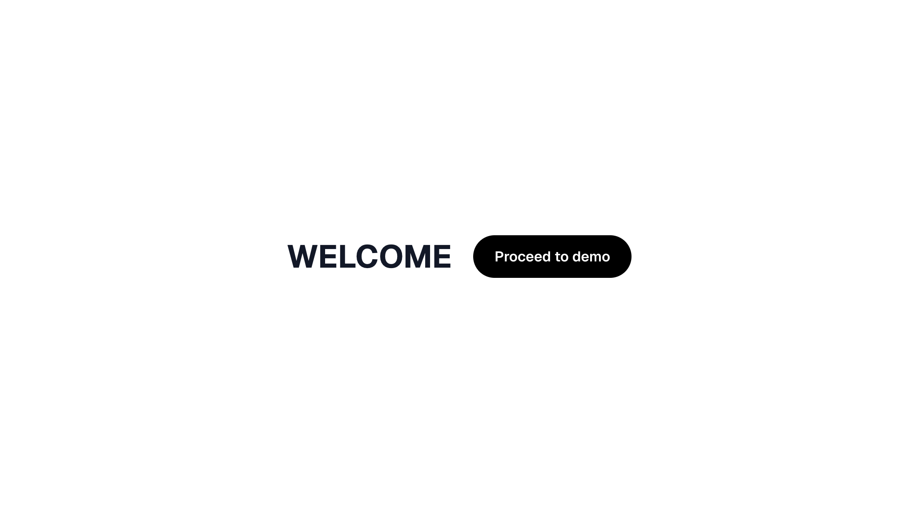
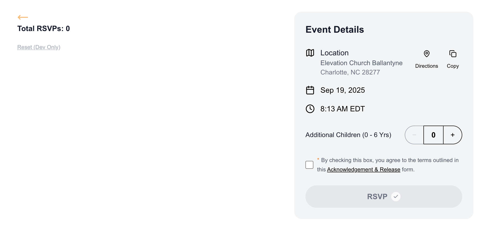
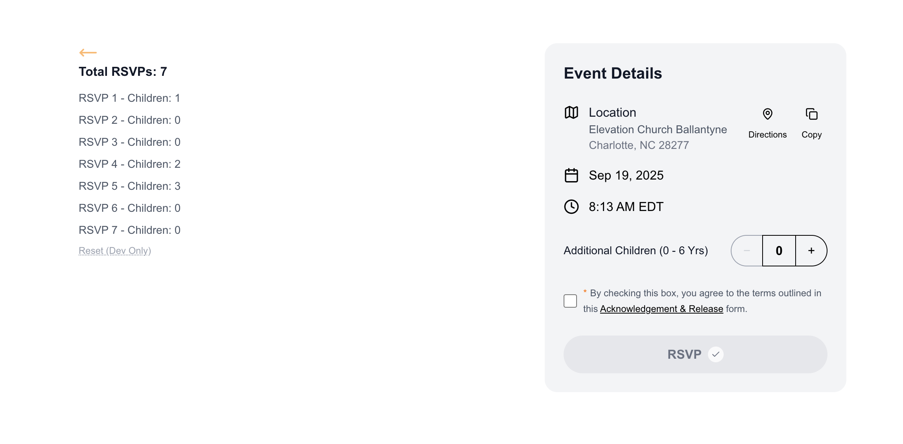

# Elevation | Events RSVP - Demo

## Overview

A demo of the RSVP signup component.

## Data Decisions

- Local storage first.
- I save RSVPs to `localStorage` as requested so the list survives refreshes.
- Each RSVP carries a timestamp so we sort or audit later without changing the data shape.
- I used one event object so that it's easy to swap in API data or CMS content later easily.

## Running It Locally

```bash
npm install
npm run dev
```

Visit http://localhost:3000 to start on the welcome screen.
Head to `/events` to interact with the RSVP experience.
I added "Reset (Dev Only)" link to clear stored submissions - for development use only.

## For production, l would...

- Swap the static event object for an api call to highlight how the component scales.
- Add form validation for additional guest details once the flow expands beyond a counter.
- Sync submissions to an API so multiple devices stay in step.

## At glance screenshots

Just an entry point to test the rsvp demo


Initial State of the Component and page before processing data.


What proessed RSVPs look like as requested.


## Project Structure

```text
src/
├─ app/
│  ├─ layout.tsx          // Root layout + metadata setup
│  ├─ page.tsx            // Welcome screen entry point
│  └─ events/
│     └─ page.tsx         // RSVP view that manages submission state
├─ components/
│  └─ EventSignup.tsx     // Form surface that raises onSubmit
├─ hooks/
│  └─ localStorage.ts     // Shared localStorage persistence helper
public/
├─ assets/                // README screenshots
└─ favicon.png            // App favicon
```
