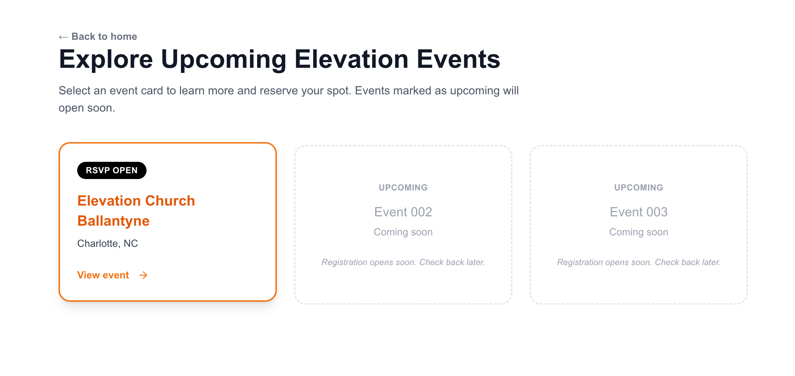
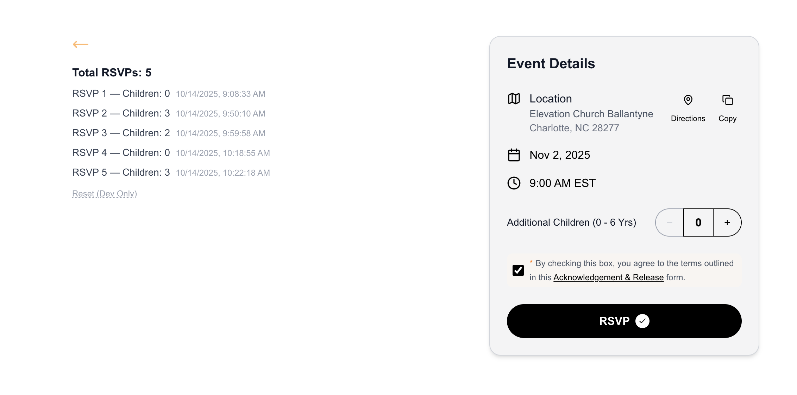

# Elevation | Events RSVP - Demo

## Overview

A demo of the RSVP signup component.

## Data Decisions

- Local storage first.
- I save RSVPs to `localStorage` as requested so the list survives refreshes.
- Each RSVP carries a timestamp so we sort or audit later without changing the data shape.
- I used one event object so that it's easy to swap in API data or CMS content later easily.

## Running It Locally

```bash
npm install
npm run dev
```

Visit http://localhost:3000 to start on the welcome screen.

- Head to `/events` to see all events and click on an ivent to interact with the RSVP experience.
- I added "Reset function" link to clear stored submissions - for development use only.

### API quick tests

You can hit the mock endpoints directly to inspect their payloads:

- Event data:

  ```bash
  curl http://localhost:3000/api/events/test-event-123
  ```

  Any other ID (for example `/api/events/bad-id`) will return `{ "error": "Event not found" }`.

- RSVP submission:
  ```bash
  curl -X POST http://localhost:3000/api/rsvp \
       -H "Content-Type: application/json" \
       -d '{"eventId":"test-event-123","childrenCount":2,"acknowledgement":true}'
  ```
  Adjust the payload to explore the validation errors:
  - Wrong `eventId` → `Unknown eventId`
  - `childrenCount` outside 0–6 → range error message
  - `acknowledgement` not `true` → acknowledgement error

## For production, l would...

- Swap the static event object for an api call to highlight how the component scales.
- Add form validation for additional guest details once the flow expands beyond a counter.
- Sync submissions to an API so multiple devices stay in step.

## At glance screenshots

Just an entry point to test the rsvp demo


The events page - shows current and ucmoing events


Initial State of the Component and page before processing data.


What proessed RSVPs look like as requested.


## Project Structure

```text
src/
├─ app/
│  ├─ layout.tsx          // Root layout + metadata setup
│  ├─ page.tsx            // Welcome screen entry point
│  ├─ api/
│  │  ├─ events/[id]/route.ts  // Mock event data endpoint
│  │  └─ rsvp/route.ts         // RSVP POST endpoint with validation
│  └─ events/
│     ├─ [id]/page.tsx         // Server-side fetched RSVP page
│     └─ page.tsx              // Events listing grid
├─ components/
│  ├─ EventSignup.tsx     // Form surface that raises onSubmit
│  └─ RsvpPanel.tsx       // Summary + signup orchestration
├─ hooks/
│  └─ localStorage.ts     // Shared localStorage persistence helper
└─ types/
   └─ events.ts           // Shared event + submission typings
public/
├─ assets/                // README screenshots
└─ favicon.png            // App favicon
```

## Thank you

- Samuel Abinsinguza
